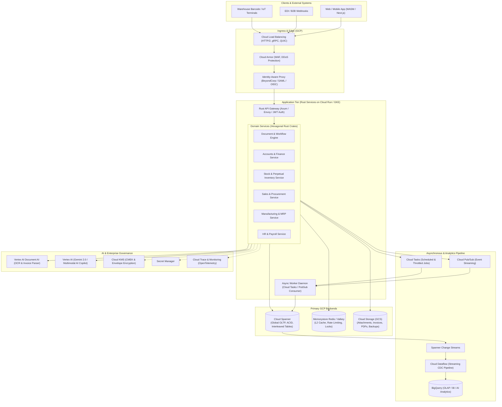
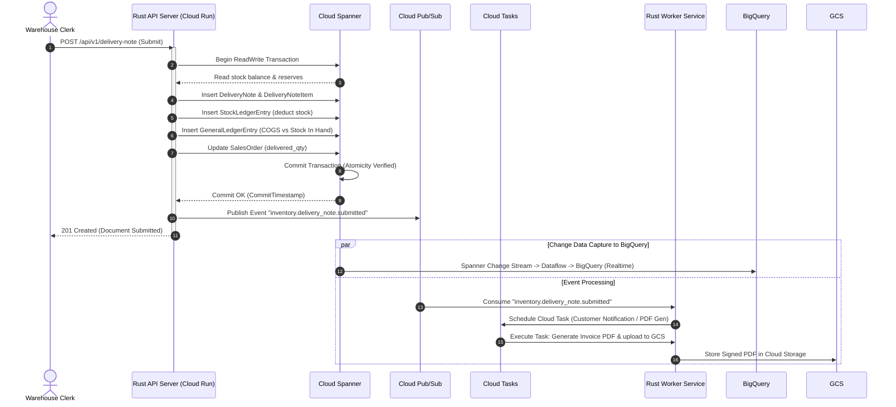
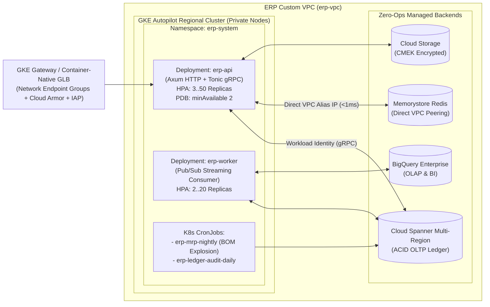

# NextGen ERP (Rust + GCP): Enterprise System Architecture & Technical Specification

## 1. Executive Summary & Design Philosophy

This specification outlines the architecture, data models, state machines, and GCP cloud-native integrations for an enterprise-grade ERP system implemented in **Rust**, drawing upon the domain capabilities and modular structure of **ERPNext** (Frappe Framework) while replacing its traditional monolithic LAMP/Python/MariaDB stack with a high-throughput, memory-safe, horizontally scalable, and globally consistent distributed cloud architecture.

### Core Architectural Pillars
1. **Memory Safety & Zero-Cost Abstractions**: Written in Rust (`tokio`, `axum`, `tonic`, `rust_decimal`), eliminating concurrency races, null pointer vulnerabilities, and garbage collection pauses during high-volume accounting/inventory processing.
2. **Immutable Append-Only Ledgers**: Double-entry bookkeeping (`GeneralLedgerEntry`) and perpetual inventory (`StockLedgerEntry`) are strictly append-only, leveraging **Google Cloud Spanner** with true serializable ACID multi-region transactions and commit timestamps.
3. **Decoupled Event-Driven Core**: Transaction processing is separated from async side effects, document indexing, alerting, and analytical reporting via **Cloud Pub/Sub** and **Cloud Tasks**.
4. **Zero-ETL Real-time Analytics**: Transactional data from Spanner is continuously replicated via **Spanner Change Streams** to **BigQuery**, enabling instant financial rollups, P&L, balance sheets, and predictive ML without degrading OLTP operations.
5. **Native AI Document & Business Intelligence**: Direct integration with **Vertex AI Document AI** for automated invoice/receipt parsing, **Gemini 2.0 / 1.5 Pro** for conversational enterprise copilot workflows, and **Spanner Vector Search** for semantic catalog search.

---

## 2. High-Level System Architecture



---

## 3. GCP Backend Service Mapping Matrix

| ERP Functional Need | Traditional ERPNext Stack | NextGen Rust + GCP Target | Key Technical Advantage |
| :--- | :--- | :--- | :--- |
| **Transactional Database (OLTP)** | MariaDB / PostgreSQL single node | **Cloud Spanner** | Globally distributed, 99.999% SLA, serializable transactions, parent-child interleaved tables, commit timestamps. |
| **Read Cache / Locking** | Redis (local instance) | **Memorystore (Redis/Valkey)** | High-availability managed in-memory cache, low-latency distributed locks for numbering sequences. |
| **Event Streaming & Decoupling** | Redis PubSub / Custom hooks | **Cloud Pub/Sub** | At-least-once or exactly-once delivery, horizontal scalability, multi-region event bus for domain events. |
| **Background / Scheduled Jobs** | Celery / RQ / Frappe Scheduler | **Cloud Tasks + Cloud Scheduler** | Serverless task queuing, fine-grained rate limits, backoff retries, and scheduled cron triggers. |
| **File / Media Storage** | Local filesystem / S3 | **Cloud Storage (GCS)** | Object lifecycle (7-year tax archive), signed upload URLs, multi-regional durability, CMEK encryption. |
| **Analytical Reporting & BI (OLAP)**| Heavy SQL queries on MariaDB | **BigQuery + Spanner Change Streams** | Serverless petabyte-scale data warehouse, zero transactional lock contention, instantaneous complex rollups. |
| **Document OCR & AP Automation** | External integrations / Tesseract | **Vertex AI Document AI** | Pre-trained invoice/expense parser, automated PO line matching, table extraction. |
| **ERP Assistant / Enterprise AI** | None (or experimental OpenAI) | **Vertex AI Gemini 2.0 / 1.5 Pro** | Contextual natural-language reporting, automated supplier email replies, inventory anomaly detection. |
| **Identity & Access Management** | Frappe user/password + OAuth | **Cloud Identity / BeyondCorp IAP** | Enterprise SSO (SAML 2.0, OIDC), device authorization, fine-grained role-based access control. |
| **Secrets & Encryption Keys** | `site_config.json` on disk | **Secret Manager + Cloud KMS** | Zero plaintext secrets, customer-managed encryption keys, envelope encryption for PII/banking tokens. |
| **Compute / Deployment** | Bare metal / VM / Docker Compose | **Cloud Run v2 / GKE Enterprise** | Instant auto-scaling from 0 to thousands of instances, Rust cold starts < 15ms, minimal RAM footprint (<30MB). |
| **Observability & Auditing** | Flat log files | **Cloud Logging + Cloud Trace + Cloud Monitoring** | OpenTelemetry native distributed tracing across gRPC and database RPCs, structured audit logs. |

---

## 4. ERPNext Domain Functional Parity & Crate Structure

The system is organized as a high-performance **Cargo Workspace** implementing Clean / Hexagonal Architecture:

```
rust-erp/
├── Cargo.toml
├── crates/
│   ├── erp-core/             # Shared types: Money, UOM, DocStatus, AuditMetadata, Traits
│   ├── erp-doctype/          # Schema engine, dynamic fields, validation macros, JSON Schema
│   ├── erp-spanner/          # Cloud Spanner client, transaction wrappers, query builders
│   ├── erp-events/           # Cloud Pub/Sub publishers, subscribers, event envelope
│   ├── erp-accounts/         # Chart of Accounts, General Ledger, Invoicing, Tax, Payments
│   ├── erp-stock/            # Items, Warehouses, Stock Ledger, Valuation (FIFO/Moving Avg)
│   ├── erp-buying/           # Suppliers, RFQ, Supplier Quotation, PO, Purchase Receipt
│   ├── erp-selling/          # Customers, Leads, Quotations, Sales Orders, Delivery Notes
│   ├── erp-manufacturing/    # Workstations, BOMs, Operations, Work Orders, MRP Engine
│   ├── erp-hr/               # Employees, Attendance, Leave, Payroll Entry, Expense Claims
│   ├── erp-ai/               # Vertex AI (Document AI, Gemini 2.0 SDK client, Embeddings)
│   ├── erp-api/              # Axum HTTP + Tonic gRPC API layer, auth middleware
│   └── erp-worker/           # Async background consumer for Cloud Tasks & Pub/Sub
```

### Module Comparison & Key Domain Entities

#### 1. Accounts (Financials)
* **ERPNext Parity**: Company, Fiscal Year, Chart of Accounts, Cost Center, Journal Entry, Sales Invoice, Purchase Invoice, Payment Entry, Payment Ledger, Asset Depreciation.
* **Rust Implementation**:
  * Currency & Arithmetic: Precision guaranteed by `rust_decimal::Decimal` (128-bit fixed point). Zero float errors.
  * Append-only `GeneralLedgerEntry`: Cancellations do not delete rows; they insert offsetting entries with opposite debit/credit values and link to original voucher.
  * Spanner Transactions: Invoices write to `SalesInvoice` and `GeneralLedgerEntry` inside the exact same atomic Spanner read-write transaction.

#### 2. Stock (Inventory & Warehousing)
* **ERPNext Parity**: Item, Item Group, UOM, Warehouse, Stock Entry (Material Receipt, Issue, Transfer, Manufacture), Delivery Note, Purchase Receipt, Serial No, Batch No, Landed Cost Voucher.
* **Rust Implementation**:
  * Real-Time Perpetual Inventory: All movements generate immutable `StockLedgerEntry` rows.
  * Valuation Engines: Implemented as pure deterministic Rust state functions:
    * `ValuationMethod::Fifo`: Tracks inventory queues with remaining quantity and unit cost.
    * `ValuationMethod::MovingAverage`: Calculates new valuation rate upon incoming receipts:
      $$\text{New Rate} = \frac{(\text{Current Qty} \times \text{Current Rate}) + (\text{Incoming Qty} \times \text{Incoming Rate})}{\text{Current Qty} + \text{Incoming Qty}}$$
  * Negative Stock Guards: Validated within Spanner serializable transactions to prevent race conditions during high-concurrency order fulfillment.

#### 3. Selling & Buying (CRM & Procurement)
* **ERPNext Parity**: Customer, Supplier, Lead, Opportunity, Quotation, Sales Order, Request for Quotation (RFQ), Supplier Quotation, Purchase Order.
* **Rust Implementation**:
  * Typestate Pattern for Document Lifecycles:
    `SalesOrder<Draft>` $\rightarrow$ `SalesOrder<Submitted>` $\rightarrow$ `SalesOrder<PartiallyDelivered>` $\rightarrow$ `SalesOrder<Completed>`. Invalid state transitions fail at compile time or via strict runtime validation tables.
  * Document Naming Series: High-throughput atomic sequence generation using Spanner Sequences (`CREATE SEQUENCE DocumentNamingSeq`).

#### 4. Manufacturing (MRP)
* **ERPNext Parity**: Bill of Materials (BOM), Workstation, Operation, Routing, Work Order, Job Card, Production Plan.
* **Rust Implementation**:
  * Recursive Exploded BOM: Pre-computed or resolved using graph traversal in Rust or Spanner Graph queries.
  * MRP Run: High-speed async calculation in worker tasks evaluating open Sales Orders, minimum warehouse reorder levels, existing stock, and lead times to automatically generate draft Material Requests and Work Orders.

---

## 5. Cloud Spanner Schema Architecture

Cloud Spanner is chosen for its multi-region external consistency, zero downtime schema migrations, and interleaved parent-child physical co-location.

### Database Design Rules
1. **No Monotonic Primary Keys**: Use `STRING(36)` UUID v4 or v7 (or reverse-hash prefixes) to avoid hotspotting across tablet splits.
2. **Interleaved Tables**: Child lines are physically stored contiguous to their parent header row on disk. For example, `SalesOrderItem` is interleaved in `SalesOrder`. Deleting or querying child rows incurs zero cross-node network hops.
3. **Commit Timestamps**: Every table uses `TIMESTAMP OPTIONS (allow_commit_timestamp = true)` to enable temporal queries and seamless Change Stream extraction.

### Core Spanner DDL Schema Excerpt

```sql
-- 1. Tenant & Organization Isolation
CREATE TABLE Companies (
    company_id STRING(36) NOT NULL,
    company_name STRING(128) NOT NULL,
    default_currency STRING(3) NOT NULL,
    country STRING(3) NOT NULL,
    created_at TIMESTAMP NOT NULL OPTIONS (allow_commit_timestamp = true),
    updated_at TIMESTAMP NOT NULL OPTIONS (allow_commit_timestamp = true)
) PRIMARY KEY (company_id);

-- 2. Document Master (Sales Order)
CREATE TABLE SalesOrders (
    company_id STRING(36) NOT NULL,
    sales_order_id STRING(36) NOT NULL,
    naming_series STRING(64) NOT NULL,
    customer_id STRING(36) NOT NULL,
    order_date DATE NOT NULL,
    delivery_date DATE NOT NULL,
    doc_status INT64 NOT NULL, -- 0: Draft, 1: Submitted, 2: Cancelled
    currency STRING(3) NOT NULL,
    conversion_rate NUMERIC NOT NULL,
    total_qty NUMERIC NOT NULL,
    net_total NUMERIC NOT NULL,
    grand_total NUMERIC NOT NULL,
    billing_status STRING(32) NOT NULL,
    delivery_status STRING(32) NOT NULL,
    created_by STRING(128) NOT NULL,
    created_at TIMESTAMP NOT NULL OPTIONS (allow_commit_timestamp = true),
    updated_at TIMESTAMP NOT NULL OPTIONS (allow_commit_timestamp = true)
) PRIMARY KEY (company_id, sales_order_id);

-- Child Table: Physically Interleaved in SalesOrders
CREATE TABLE SalesOrderItems (
    company_id STRING(36) NOT NULL,
    sales_order_id STRING(36) NOT NULL,
    line_item_id STRING(36) NOT NULL,
    item_code STRING(64) NOT NULL,
    warehouse_id STRING(36) NOT NULL,
    qty NUMERIC NOT NULL,
    delivered_qty NUMERIC NOT NULL,
    billed_qty NUMERIC NOT NULL,
    rate NUMERIC NOT NULL,
    amount NUMERIC NOT NULL,
    uom STRING(16) NOT NULL
) PRIMARY KEY (company_id, sales_order_id, line_item_id),
  INTERLEAVE IN PARENT SalesOrders ON DELETE CASCADE;

-- 3. Append-Only General Ledger
CREATE TABLE GeneralLedgerEntries (
    company_id STRING(36) NOT NULL,
    gle_id STRING(36) NOT NULL,
    posting_date DATE NOT NULL,
    account_id STRING(36) NOT NULL,
    cost_center_id STRING(36),
    party_type STRING(32), -- 'Customer', 'Supplier', 'Employee'
    party_id STRING(36),
    voucher_type STRING(32) NOT NULL, -- 'Sales Invoice', 'Payment Entry'
    voucher_no STRING(64) NOT NULL,
    debit NUMERIC NOT NULL,
    credit NUMERIC NOT NULL,
    currency STRING(3) NOT NULL,
    is_cancelled BOOL NOT NULL,
    reversal_of_gle_id STRING(36),
    created_at TIMESTAMP NOT NULL OPTIONS (allow_commit_timestamp = true)
) PRIMARY KEY (company_id, gle_id);

CREATE INDEX Idx_GLE_Account_Date 
ON GeneralLedgerEntries(company_id, account_id, posting_date DESC);

-- 4. Append-Only Stock Ledger
CREATE TABLE StockLedgerEntries (
    company_id STRING(36) NOT NULL,
    sle_id STRING(36) NOT NULL,
    item_code STRING(64) NOT NULL,
    warehouse_id STRING(36) NOT NULL,
    posting_datetime TIMESTAMP NOT NULL,
    voucher_type STRING(32) NOT NULL,
    voucher_no STRING(64) NOT NULL,
    actual_qty NUMERIC NOT NULL, -- Positive for in, negative for out
    qty_after_transaction NUMERIC NOT NULL,
    incoming_rate NUMERIC NOT NULL,
    valuation_rate NUMERIC NOT NULL,
    stock_value NUMERIC NOT NULL,
    stock_value_difference NUMERIC NOT NULL,
    batch_no STRING(64),
    serial_no STRING(64),
    is_cancelled BOOL NOT NULL,
    created_at TIMESTAMP NOT NULL OPTIONS (allow_commit_timestamp = true)
) PRIMARY KEY (company_id, sle_id);

CREATE INDEX Idx_SLE_Item_Warehouse 
ON StockLedgerEntries(company_id, item_code, warehouse_id, posting_datetime DESC);
```

---

## 6. Event-Driven Pipeline & Async Architecture



### Event Taxonomy
* **`sales.order.submitted`**: Triggers reservation in stock engine and updates CRM pipeline in BigQuery.
* **`stock.ledger.updated`**: Triggers reorder level evaluations; triggers automated creation of `MaterialRequest` if balance falls below safety threshold.
* **`accounts.invoice.paid`**: Clears outstanding balance, dispatches payment receipt email, updates credit rating.

---

## 7. Concrete Rust Domain Engine & State Machine

Here is how the core document model, decimal safety, and ledger posting are authored in idiomatic Rust:

### 7.1. Typestate Pattern & Document Lifecycle

```rust
use rust_decimal::Decimal;
use serde::{Deserialize, Serialize};
use std::marker::PhantomData;
use uuid::Uuid;

// Document status lifecycle markers
pub struct Draft;
pub struct Submitted;
pub struct Cancelled;

pub trait DocState {}
impl DocState for Draft {}
impl DocState for Submitted {}
impl DocState for Cancelled {}

#[derive(Debug, Clone, Serialize, Deserialize)]
pub struct SalesOrderLine {
    pub line_id: Uuid,
    pub item_code: String,
    pub warehouse_id: Uuid,
    pub qty: Decimal,
    pub rate: Decimal,
    pub amount: Decimal,
}

#[derive(Debug, Clone)]
pub struct SalesOrder<S: DocState> {
    pub order_id: Uuid,
    pub company_id: Uuid,
    pub customer_id: Uuid,
    pub naming_series: String,
    pub lines: Vec<SalesOrderLine>,
    pub net_total: Decimal,
    pub grand_total: Decimal,
    pub state: PhantomData<S>,
}

impl SalesOrder<Draft> {
    pub fn new(company_id: Uuid, customer_id: Uuid, naming_series: String) -> Self {
        Self {
            order_id: Uuid::new_v4(),
            company_id,
            customer_id,
            naming_series,
            lines: Vec::new(),
            net_total: Decimal::ZERO,
            grand_total: Decimal::ZERO,
            state: PhantomData,
        }
    }

    pub fn add_item(&mut self, item_code: String, warehouse_id: Uuid, qty: Decimal, rate: Decimal) {
        let amount = qty * rate;
        self.lines.push(SalesOrderLine {
            line_id: Uuid::new_v4(),
            item_code,
            warehouse_id,
            qty,
            rate,
            amount,
        });
        self.recalculate();
    }

    fn recalculate(&mut self) {
        self.net_total = self.lines.iter().map(|l| l.amount).sum();
        self.grand_total = self.net_total; // Add tax lines logic here
    }

    /// Transition to Submitted state
    pub fn submit(self) -> Result<SalesOrder<Submitted>, &'static str> {
        if self.lines.is_empty() {
            return Err("Cannot submit an empty Sales Order");
        }
        if self.grand_total <= Decimal::ZERO {
            return Err("Grand total must be greater than zero");
        }
        Ok(SalesOrder {
            order_id: self.order_id,
            company_id: self.company_id,
            customer_id: self.customer_id,
            naming_series: self.naming_series,
            lines: self.lines,
            net_total: self.net_total,
            grand_total: self.grand_total,
            state: PhantomData,
        })
    }
}

impl SalesOrder<Submitted> {
    pub fn cancel(self) -> Result<SalesOrder<Cancelled>, &'static str> {
        // Validation: verify no downstream Delivery Notes or Invoices are active
        Ok(SalesOrder {
            order_id: self.order_id,
            company_id: self.company_id,
            customer_id: self.customer_id,
            naming_series: self.naming_series,
            lines: self.lines,
            net_total: self.net_total,
            grand_total: self.grand_total,
            state: PhantomData,
        })
    }
}
```

### 7.2. Double-Entry Accounting Ledger Engine

```rust
use chrono::NaiveDate;
use rust_decimal::Decimal;
use uuid::Uuid;

#[derive(Debug, Clone)]
pub struct GLPostingRequest {
    pub company_id: Uuid,
    pub posting_date: NaiveDate,
    pub voucher_type: String,
    pub voucher_no: String,
    pub entries: Vec<GLEntryItem>,
}

#[derive(Debug, Clone)]
pub struct GLEntryItem {
    pub account_id: Uuid,
    pub cost_center_id: Option<Uuid>,
    pub debit: Decimal,
    pub credit: Decimal,
}

pub struct GeneralLedgerEngine;

impl GeneralLedgerEngine {
    /// Validates fundamental accounting invariant: Sum(Debits) == Sum(Credits)
    pub fn validate_and_balance(req: &GLPostingRequest) -> Result<(), AccountingError> {
        let mut total_debit = Decimal::ZERO;
        let mut total_credit = Decimal::ZERO;

        for entry in &req.entries {
            if entry.debit < Decimal::ZERO || entry.credit < Decimal::ZERO {
                return Err(AccountingError::NegativeAmount);
            }
            if entry.debit > Decimal::ZERO && entry.credit > Decimal::ZERO {
                return Err(AccountingError::SimultaneousDebitAndCredit);
            }
            total_debit += entry.debit;
            total_credit += entry.credit;
        }

        if total_debit != total_credit {
            return Err(AccountingError::UnbalancedEntry {
                debit: total_debit,
                credit: total_credit,
                difference: total_debit - total_credit,
            });
        }

        Ok(())
    }
}

#[derive(thiserror::Error, Debug)]
pub enum AccountingError {
    #[error("Debit and credit entries cannot be negative")]
    NegativeAmount,
    #[error("Single entry line cannot have both debit and credit")]
    SimultaneousDebitAndCredit,
    #[error("Unbalanced ledger entry: Debits={debit}, Credits={credit}, Diff={difference}")]
    UnbalancedEntry {
        debit: Decimal,
        credit: Decimal,
        difference: Decimal,
    },
}
```

---

## 8. GCP Intelligence Layer (Vertex AI & Document AI)

### 1. Vertex AI Document AI for Accounts Payable Automation
* **Workflow**: Incoming supplier invoices (PDF/TIFF) uploaded to a Cloud Storage drop bucket (`gs://company-invoices-incoming/`).
* **Processing**:
  1. GCS Object Finalize triggers a Cloud Function / Cloud Run service.
  2. The service calls **Document AI Invoice Processor** (`projects/.../locations/.../processors/...`).
  3. Extracted entities (`supplier_name`, `invoice_id`, `invoice_date`, `total_amount`, `line_items`, `tax_amount`) are returned as structured JSON.
  4. Rust matching engine performs fuzzy matching against registered Suppliers and open Purchase Orders.
  5. Automatically drafts a `PurchaseInvoice<Draft>` in Cloud Spanner for human review or straight-through processing.

### 2. Vertex AI Gemini 2.0 Enterprise Copilot
* Embedded AI agent communicating with ERP backend via gRPC Tool Calling / Function Calling:
  * *"Show me warehouse inventory that hasn't moved in 90 days."* $\rightarrow$ Executes BigQuery SQL against inventory snapshots.
  * *"Draft an order cancellation notice to customer Acme Corp for SO-2026-004."* $\rightarrow$ Loads customer contact and order lines, formats email.
  * *"Detect anomalies in Journal Entries submitted this week."* $\rightarrow$ Analyzes GL deviations against historical distributions using Vertex AI embeddings.

---

## 9. Security, Compliance & Multi-Tenancy

1. **Multi-Tenant Data Isolation**:
   * **Tenant Isolation Strategy**: Row-level tenant partitioning via `company_id` enforced in all Spanner primary keys and queries.
   * **Spanner Fine-Grained Access Control (FGAC)**: Database roles mapped to IAM principals preventing unauthorized cross-company reads.
2. **Cryptographic Protection**:
   * **Cloud KMS (CMEK)**: All Spanner databases, BigQuery datasets, and GCS buckets encrypted with customer-managed keys.
   * **Envelope Encryption**: Bank account numbers, employee tax identifiers, and credit card tokens encrypted at the application level using KMS key encryption keys (KEK) and local data encryption keys (DEK).
3. **Auditability & SOX Compliance**:
   * Immutable commit timestamps on every Spanner mutation guarantee tamper-evident chronological ordering.
   * Zero physical row deletions in financial or inventory ledgers; only reversal vouchers are permitted.

---

## 10. Computing Infrastructure Architecture: GKE vs. Cloud Run

The Rust ERP supports two managed GCP compute runtimes, selectable in Terraform via `var.compute_platform = "gke" | "cloud_run" | "hybrid"` (defaulting to **`gke`** for enterprise production).

### Why Google Kubernetes Engine (GKE Autopilot) is Primary for Enterprise ERP
While Cloud Run is ideal for stateless HTTP request/response APIs, a full-scale ERP has several operational requirements where **GKE Autopilot** excels:

| Architectural Dimension | GKE Autopilot (`compute_platform = "gke"`) | Cloud Run v2 (`compute_platform = "cloud_run"`) |
| :--- | :--- | :--- |
| **Long-Lived Streaming Daemons** | Native support for persistent **Pub/Sub streaming pull** workers, continuous CDC processors, and long-lived bidirectional gRPC/WebSocket streams for warehouse barcode scanners. | Request-scoped or CPU-allocated instances; less suited for stateful in-memory stream batching or multi-hour background loops. |
| **Heavy Batch & MRP Runs** | Native Kubernetes **`CronJob`** and **`Job`** primitives for multi-hour Material Requirements Planning (MRP), BOM explosions, and monthly payroll runs without request timeouts. | Cloud Run Jobs (max 24h, fewer orchestration primitives for complex DAG dependencies). |
| **VPC-Native Redis & Spanner Networking** | **Direct Alias IP routing**: Pods sit natively inside the VPC subnet (`10.100.0.0/14`) and talk directly to Memorystore Redis with sub-millisecond latency—no Serverless VPC Access Connector bottleneck. | Requires a Serverless VPC Access Connector bridge (`10.10.16.0/28`) to reach private Memorystore Redis IPs. |
| **Zero-Key Security & Isolation** | **GKE Workload Identity Federation** (`iam.gke.io/gcp-service-account`), `NetworkPolicy` pod-to-pod firewalls, `PodDisruptionBudget` (PDB), and Cloud KMS etcd secret encryption. | Per-service IAM service account; no fine-grained L3/L4 network policy between internal microservices. |
| **Cost Profile** | Optimal for steady-state 24/7 enterprise traffic with predictable pod bin-packing and committed use discounts. | Optimal for dev/staging or bursty SMB tenants where scale-to-zero saves idle compute cost. |

### GKE Production Topology



### Key Performance & Operational Metrics
* **Rust Binary Footprint**: $\approx 25\,\text{MB}$ distroless Docker container (`gcr.io/distroless/cc-debian12:nonroot`).
* **Startup Latency**: $< 20\,\text{ms}$ pod readiness (vs. Frappe/Python 4–8 seconds).
* **Memory Utilization**: $\approx 35\,\text{MB}$ RSS per pod under load.
* **Throughput Capacity**: $> 15,000$ read queries/sec and $> 4,000$ transactional writes/sec per Cloud Spanner node.
* **Zero Scheduled Maintenance**: GKE Surge Upgrades with `PodDisruptionBudget` + Spanner zero-downtime schema migrations.

---

## 11. Terraform & Kubernetes Infrastructure as Code (IaC)

A complete, production-grade Terraform and Kubernetes manifest suite is included in [`terraform/`](../terraform/) and [`k8s/`](../k8s/):

```
├── Dockerfile                     # Multi-stage Rust builder -> distroless nonroot runtime image
├── k8s/                           # Kubernetes manifests for GKE Autopilot / Standard
│   ├── base.yaml                  # Namespace (erp-system), Workload Identity ServiceAccounts, ConfigMap
│   ├── api-deployment.yaml        # erp-api Deployment, NEG Service, HPA (3..50), PodDisruptionBudget
│   └── worker-and-cronjobs.yaml   # erp-worker Deployment + Nightly MRP & Ledger Audit CronJobs
└── terraform/                     # GCP Infrastructure as Code
    ├── main.tf                    # Provider setup and GCP API enablement (including container.googleapis.com)
    ├── variables.tf               # Configurable parameters (compute_platform = "gke" | "cloud_run" | "hybrid")
    ├── gke.tf                     # GKE Autopilot Private Cluster, VPC-native IPs, Workload Identity, KMS etcd
    ├── cloud_run.tf               # Optional Cloud Run v2 services (when compute_platform = "cloud_run" | "hybrid")
    ├── kms.tf                     # Cloud KMS KeyRing & CMEK keys for Spanner, Storage, BQ, GKE etcd, and Envelope
    ├── networking.tf              # VPC, Subnet with GKE Pod/Service secondary ranges, Cloud NAT, & Peering
    ├── spanner.tf                 # Spanner Instance, Database with CMEK, Interleaved DDL, & Change Stream
    ├── redis.tf                   # Memorystore Redis instance with VPC peering & TLS encryption
    ├── storage.tf                 # GCS buckets for invoices (OCR), 7-year audit archives, and exports
    ├── messaging.tf               # Cloud Pub/Sub topics/subscriptions (ordered) & Cloud Tasks queue
    ├── analytics.tf               # BigQuery dataset with CMEK & real-time P&L reporting views
    ├── ai.tf                      # Vertex AI Document AI Invoice Processor & Secret Manager
    ├── iam.tf                     # Least-privilege Service Accounts & GKE Workload Identity bindings
    ├── outputs.tf                 # GKE cluster credentials command, Spanner URI, Redis host, and endpoints
    ├── terraform.tfvars.example   # Sample input values
    └── README.md                  # Deployment guide and step-by-step instructions
```

